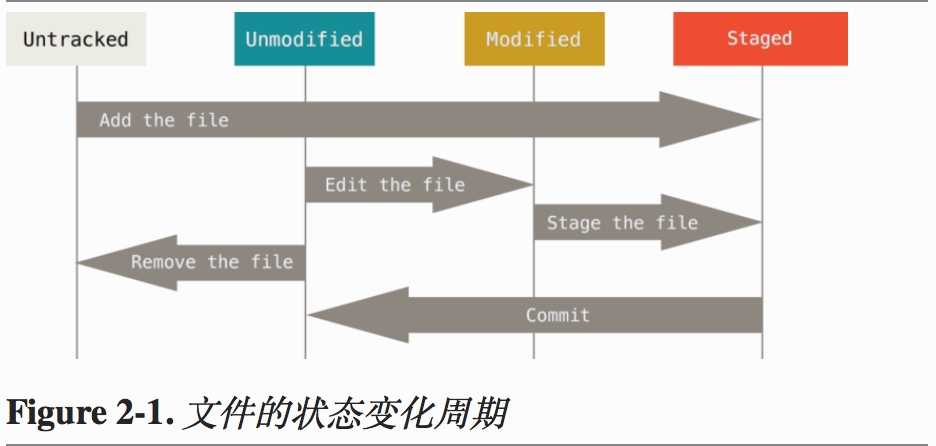
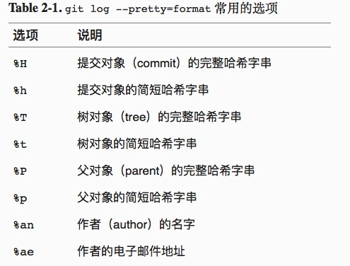
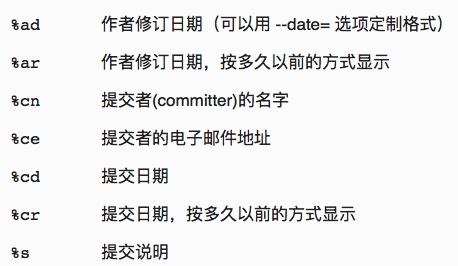
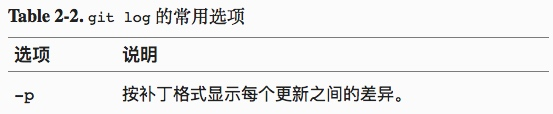
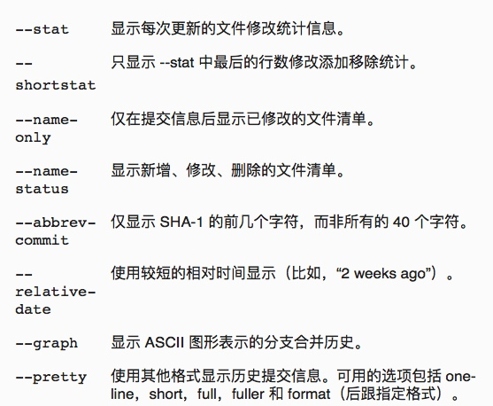
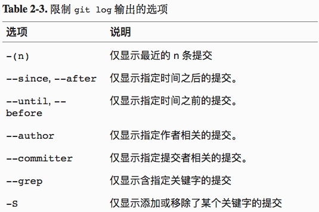

# git常用命令笔记

## 配置篇

1. 全局的配置:
>git config --global user.name duan
>git config --global user.email duan@123.com

2. 单个项目的配置需要在项目目录下执行
>git config user.name duan
>git config user.email duan@123.com

3. 文本编辑器配置
>git config --global core.editor emacs

4. 检查配置
>git config --list

5. 检查某项配置
>git config \<key>:
>例如:
>git config user.name

6. 获取帮助
>git help \<verb>
>git \<verb> --help
>man git-\<verb>
>例如:
>git help config

##基础操作篇(基础命令) 
1. 获取Git仓库
    * 在现有项目或目录下导入所有文件到Git中.

        >初始化仓库,在项目目录执行
        >git init
        
    * 从服务器克隆一个现有的Git仓库.

        >git clone [url] [name];[name]为可选参数

2. 检查当前文件状态
    * 使用Git时文件的生命周期

    >git status
    >git status -s | git status --short
    
3. 跟踪新文件
    * 使文件暂存(处于staged状态)|(理解为:添加内容到下一次提交)
    
    >git add \<file>|(files) 执行后,文件处于staged状态
    
    git add多重作用:
        1. 开始跟踪新文件.
        2. 把已跟踪的文件放入暂存区.
        3. 合并时把有冲突的文件标记为已解决
    
    
    
    * 取消文件的staged状态,返回到git add执行前
    
    >git reset HEAD \<file>
    
    * 取消文件的修改
    
    >git checkout --\<file>
    
4. 忽略文件 .gitignore

    忽略文件的格式规范:

    + 所有空行或者以#开头的行都会被Git忽略
    + 可以使用标准的glob模式匹配
    + 匹配模式可以以(/)开头防止递归
    + 匹配模式可以以(/)结尾指定目录
    + 要忽略指定模式以外的文件或目录,可以在模式前加上惊叹号(!)取反
    
    
所谓的 glob 模式是指 shell 所使用的简化了的正则表达式。 星号（*）匹配零个或多个任意字符；[abc] 匹配任何一个列在方括号中的字符（这个例子要么匹配一个 a，要么匹配一个 b，要么匹配一个 c）；问号（?）只匹配一个任意字符；如果在方括号中使用短划线分隔两个字符，表示所有在这两个字符范围内的都可以匹配（比如 [0-9] 表示匹配所有 0 到 9 的数字）。 使用两个星号（*) 表示匹配任意中间目录，比如a/**/z 可以匹配 a/z, a/b/z 或 a/b/c/z等。

5. 查看已暂存和未暂存的修改(git diff)

    * 用来查看那些修改没有暂存
    * 用来查看哪些更新已经暂存起来准备好了下次提交

    >git diff :比较的是工作目录中当前文件和暂存区域快照之间的差异,也就是修改之后还没有暂存起来的变化内容.
    >git diff --cached | git diff --staged : 比较的是已暂存的将要添加到下次提交里的内容
    
6. 修改提交 git commit

    >git commit 
    >git commit -m '提交内容说明'
    >git commit -a -m '提交内容说明(隐含:git add)'
    
7. 移除文件 git rm
    
    >git rm \<file> 
    >git rm -f \<file> 强制删除
    >git rm -cached \<file>
    >git rm log/\\\*.log     支持glob模式
    >git rm \\\*~
    
8. 移动文件 git mv

    >git mv file_from file_to
    >其实 git mv相当于运行了下面三个命令
    >mv file_from file_to
    >git rm file_from
    >git add file_to
    
9. 查看提交历史
    
    >git log
    >git log -p -2; -p显示每次内容的差异, -2最近两次
    >git log --stat; 额外列出所有被修改的文件,有多少文件被修改了,以及被修改过的文件的那些行被移除或添加了.每次提交的最后还有一个总结.
    >git log --pretty=oneline|short|full|fuller
    >git log --pretty=format:"%h - %an, %ar : %s"
    

    >git log --pretty=format:"%h %s" --graph
    

    * 限制输出长度 --since | --until
    
    > git log --since=2.weeks
    >参数可是是: "2008-01-15" 或 "2 years 1 day 3 minutes ago"
    >使用搜索条件. --author 指定作者, --grep 提交说明中的关键字. 要同时满足需要 --all-match. -S 筛选添加或移除某些字符串的提交.
    >git log -Sfunction_name
    >git log -- (path) ;放在最后
    

10. 撤销操作(撤销操作是不可逆的,会因为操作失误而导致工作丢失)

    > git commit --amend 第二次的提交将代替上一次的提交

    * 取消暂存的文件
    
    > git reset HEAD [file]; (危险)
    
    * 撤销对文件的修改
    
    > git checkout -- [file]; (危险)
    
11. 远程仓库的使用(管理远程仓库包括:了解如何添加远程仓库,移除无效的远程仓库,管理不同的远程分支并定义他们是否被跟踪等等)

    * 查看已经配置的远程仓库
    
    > git remote -v
    
    * 添加远程仓库
    
    > git remote add \<shortname> \<url>
    
    * 从远程仓库中抓取与拉取
    
    > git fetch [remote-name]
    
    * 推送到远程分支
    
    > git push [remote-name] [branch-name]
    
    * 查看远程仓库
    
    > git remote show [remote-name]
    
    * 远程仓库的移除和重命名
    
    > git remote rename origin origin1
    > git remote rm origin1
    
12. 打标签

    * 列出标签
    
    > git tag 
    
    * 创建标签(两种主要类型的标签:轻量标签(ligitweight),附注标签(annotated))
    
    > git tag v0.0.1-l
    > git tag -a v0.0.1 -m '这是一个附注标签'
    > git tag -a v0.0.2 \<校验和(提交历史字符串)>
    
    * 共享标签
    
    > git push origin [tagname];(显式推送标签)
    > git push origin --tags
    
    * 检出标签
    
    > git checkout -b [branchname] [tagname];在特定的标签上创建一个新的分支.
    > git checkout -b version001 v0.0.1;如何改动提交了内容,则该版本就会与原来标签版本有所不同.需要注意当心.
    
13. Git别名

    > git config --global alias.co checkout
    > git config --global alias.br branch
    > git config --global alias.ci commit
    > git config --global alias.st status
    > git config --global alias.unstage 'reset HEAD --'
    >git unstage fileA 等价于 git reset HEAD -- fileA
    > git config --global alias.last 'log -1 HEAD'
    
    * 如果想要执行外部命令,而不是git的子命令, 可以在命令前加上'!'符号.
    
    > git config --global alias.visual '!gitk'
    
    
    
    
    
    
    
    
    
    
    
    
    
    

    
        

